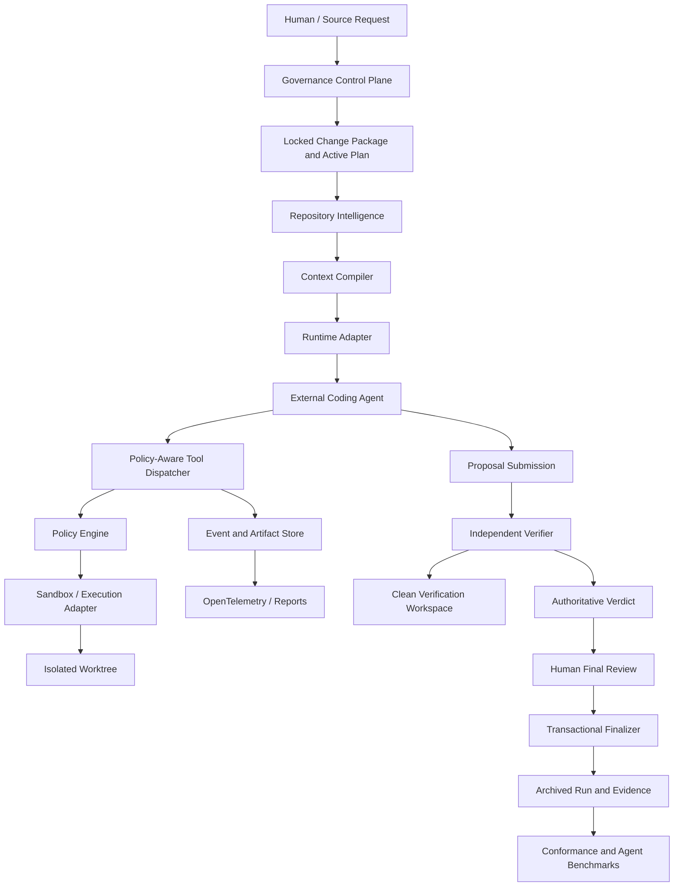

# Agent Harness v4 — Detailed Implementation Plan

**Status:** Reconciled v4-core implementation contract  
**Baseline:** Enhanced clean harness, `v3-core`, `AUDIT_ONLY`  
**Target:** A provider-neutral, deterministic v4-core control system that improves repository evidence, context continuity, tool authorization, independent verification, and honest evaluation while preserving the repository-local `AUDIT_ONLY` boundary  
**Prepared:** 2026-07-18

## Update History

Updated: 2026-07-18 22:30

## Binding v4-core implementation contract

This section is binding for implementation. Later research sections may describe
future integrations, but an implementation agent must follow this section when
the sections disagree.

### Product purpose

The harness lets a coding agent work autonomously while preventing the agent
from deciding for itself:

- what the locked request means after approval;
- what files or checks it is allowed to change or run;
- whether verification passed;
- whether remediation is complete; or
- whether the task may be finalized.

The agent remains a proposal-producing worker. The harness, verifier, and
finalizer remain authoritative.

### v4-core scope

Implement only these six enhancements:

1. **Repository evidence correctness** — scan the declared repository root,
   produce source-backed claims, and distinguish observed, declared, inferred,
   and unknown facts.
2. **Standalone audit** — inspect completed runs without an active plan and
   report task, projection, evidence, intake, and finalization drift.
3. **Deterministic context compilation** — compile relevant requirements,
   source, tests, ADRs, failures, and human-provided artifacts with hashes,
   selection reasons, and a hard budget.
4. **Controlled tool interface** — replace arbitrary agent check execution with
   registered, schema-validated, plan-approved operations.
5. **Independent verification** — treat agent submissions as proposals and
   produce the authoritative verdict from a harness-controlled verification
   path.
6. **Honest evaluation and replay evidence** — separate harness conformance
   from real agent-task evaluation and record enough evidence to explain and
   replay each run.

### Explicit v4-core exclusions

The following are not implementation requirements for this plan:

- OS-level sandboxing or container enforcement;
- network restriction or network policy;
- external identity, secret isolation, or signed releases;
- Codex-specific or provider-specific runtime adapters;
- deployment control;
- multi-agent orchestration or delegation;
- replacing the current v3 state machine;
- changing the original research-review TOC.

The current assurance mode remains `AUDIT_ONLY`. The harness may report that a
policy would be violated, but v4-core must not claim OS-level enforcement.

### Human and autonomous behavior contract

- A human approves the task or batch contract before execution begins.
- The agent must not pause for human approval between normal implementation,
  verification, and remediation steps in an approved batch.
- Remediation continues autonomously across epochs until the issue is fixed,
  the verifier confirms failure for a reason requiring a new interpretation, or
  deterministic loop detection requires a rethink record.
- A human reviews the final batch result, not every individual remediation
  attempt.
- Only the harness-controlled verifier may produce the authoritative pass
  verdict, and only the finalizer may produce `FINALIZED`.

### Ordered implementation slices

Each slice is one harness task. Do not implement multiple slices in one active
plan. A slice is complete only when its focused tests, required evidence, and
the v3 harness verification pass.

#### Slice 0 — Contract and audit foundation

**Goal:** make v4-core boundaries executable before changing evidence or tools.

**Allowed areas:** `.agent-harness/scripts/harness.sh`, audit/check scripts,
`.agent-harness/tests/harness/`, and v4-core plan/evidence documentation.

**Inputs:** canonical task store, runtime state, finalization journals, plan
hashes, projection files, intake references, and existing benchmark reports.

**Outputs:** standalone audit command, structured drift report, and fixtures for
clean, stale, finalized, and active states.

**Exit gate:** audit works with no active plan, reports exact mismatches, and
does not change authority or task status.

#### Slice 1 — Repository evidence correctness

**Goal:** ensure repository intelligence describes the declared target repo.

**Allowed areas:** `repository-intelligence.sh`, context checks, repository
intelligence tests, and generated evidence schemas.

**Inputs:** explicit repository root, Git file list when available, filesystem
fallback, task scope, and existing repository documents.

**Outputs:** inventory, source-backed claim records, root binding, hashes, and
separate generated-versus-verified evidence.

**Exit gate:** harness scans the target root rather than `$PWD`, every high-
impact claim has source evidence, stale evidence fails, and generated output
never claims verification success by itself.

#### Slice 2 — Deterministic context compiler

**Goal:** make agent context complete, bounded, reproducible, and resumable.

**Allowed areas:** `context.sh`, context budget/pack checks, context schemas,
and focused context tests.

**Inputs:** locked task, approved file map, repository claims, relevant tests,
ADRs, failure/remediation evidence, and human-provided files or artifacts.

**Outputs:** context manifest containing source hashes, selection reasons,
omission reasons, budget, actual token count or conservative estimate, and
compiler version.

**Exit gate:** repeated compilation is deterministic, selected sources are
fresh, actual usage does not exceed the hard budget, and critical requirements
cannot be evicted.

#### Slice 3 — Controlled tool interface

**Goal:** prevent the agent from turning a proposal-only interface into an
arbitrary command runner.

**Allowed areas:** `agent-interface.sh`, approved-check dispatch, file-map and
workspace checks, tool schemas, and adversarial tests.

**Inputs:** locked plan, approved files, approved checks, lifecycle state, and
tool policy version.

**Outputs:** structured read/search/diff/patch/check/report operations with
policy decisions and bounded results.

**Exit gate:** arbitrary command arguments are rejected, path traversal and
symlink escapes are rejected, checks come only from the locked contract, and
agent results remain proposal-only.

#### Slice 4 — Independent verification

**Goal:** make implementation-agent claims insufficient to pass a task.

**Allowed areas:** verifier scripts, clean-workspace preparation, verdict
schemas, finalization checks, and integration tests.

**Inputs:** immutable plan hash, submitted proposal, repository baseline,
required checks, and policy checks.

**Outputs:** clean verification evidence and an authoritative `PASSED` or
`FAILED` verdict bound to the exact proposal and workspace snapshot.

**Exit gate:** a forged agent success record cannot pass; changed source,
changed plan, failed required checks, or mismatched hashes produce failure.

#### Slice 5 — Honest evaluation and replay evidence

**Goal:** measure harness conformance separately from agent capability.

**Allowed areas:** benchmark runner, hidden verification fixtures, event/artifact
schemas, redaction, replay reports, and benchmark tests.

**Inputs:** clean task fixtures, hidden checks, run events, tool decisions,
context manifest, verifier verdict, and finalization journal.

**Outputs:** conformance results, real-agent-task results when an external agent
is explicitly supplied, and replayable run summaries.

**Exit gate:** known solutions are not treated as agent success, benchmark
categories are distinct, evidence is redacted and hash-bound, and a reviewer
can reconstruct why a run passed or failed.

### Context Preservation Contract

Every slice must leave a durable handoff under the harness evidence directory.
The next agent must read the active plan, the slice handoff, the latest failure
packet, and the required source files before acting.

Each handoff must contain:

```yaml
task_id: ...
slice_id: ...
decision_summary:
  - settled decision and its reason
scope:
  allowed_files: []
  forbidden_features: []
baseline:
  plan_sha256: ...
  repository_snapshot: ...
implementation:
  changed_files: []
  behavior_added: []
verification:
  commands: []
  results: []
  evidence_files: []
open_issues: []
next_action: ...
```

Agents must not rely on chat history, hidden memory, or assumptions from a
previous run. If the handoff is missing or stale, the harness blocks the slice
until context is regenerated. The handoff is a continuity artifact, not an
authority artifact; only the locked plan, verifier, and finalizer can authorize
state transitions.

### Implementation reporting format

At the end of every slice, report only:

1. completed behavior;
2. changed files;
3. verification commands and results;
4. evidence paths and hashes;
5. unresolved issues;
6. exact next slice.

This format keeps future agents focused and prevents a long plan from being
mistaken for permission to implement every future milestone.

---

## 1. Executive decision

The current repository should **not** be rewritten. Its strongest subsystem is the deterministic governance control plane:

- specification locking;
- hash-bound approvals;
- explicit lifecycle states;
- bounded file maps;
- append-only failure and remediation evidence;
- script-owned verification;
- verifier-owned success;
- transactional finalization;
- clean package export.

The v4-core implementation should preserve those controls and add only the
repository-local evidence, context, tool, verification, audit, and evaluation
layers defined in the binding contract above.

The target product is:

> A deterministic control plane that supervises external coding agents, controls the context and tools they receive, executes them inside declared boundaries, independently verifies their proposals, and records enough evidence to replay and evaluate every run.

Provider-specific runtime adapters, including a possible **Codex CLI** adapter,
are deferred integrations. They may consume the v4-core contracts later, but
they are not part of this implementation contract and must not introduce
sandbox, network, identity, or release controls into the core repository.

---

## 2. Current-state assessment

### 2.1 Components to preserve

| Existing capability | Decision |
|---|---|
| Top-level lifecycle and machine-controlled transitions | Preserve |
| Discussion intake and specification locking | Preserve |
| One active execution contract | Preserve |
| Hash-bound approvals and ADR bindings | Preserve |
| File-map and baseline checks | Preserve |
| Failure history and remediation epochs | Preserve |
| Script-owned verification | Preserve |
| Human final-review packet | Preserve |
| Finalizer-owned `PASSED -> FINALIZED` transition | Preserve |
| Clean export and package-integrity checks | Preserve |
| Explicit `AUDIT_ONLY` assurance statement | Preserve |

### 2.2 Problems that must be corrected

1. `repository-intelligence.sh` defaults to the harness directory and writes conclusions that are specific to Scratch Harness rather than facts discovered from the target repository.
2. Repository evidence generation can label generated documents as `result: pass` without a separate verifier proving their correctness.
3. `context.sh` records a nominal budget but does not perform model-aware token counting, relevance ranking, deterministic budget allocation, or robust stale-pack detection.
4. `agent-interface.sh run-check -- <command>` permits arbitrary command execution through an interface presented as a check runner.
5. The repository has no component that owns a model–action–observation loop.
6. Tools are scripts, not registered capabilities with schemas, risk levels, permissions, limits, and structured results.
7. `AUDIT_ONLY` can detect some violations when scripts are invoked, but cannot prevent bypass, host filesystem access, or network access.
8. The brownfield benchmark copies known solution files into fixtures. It validates fixtures and expected solutions, not agent problem-solving ability.
9. Execution evidence does not yet provide complete model, context, tool, token, latency, cost, policy-decision, and sandbox-capability traces.
10. Multi-agent fields exist, but safe delegation is not implemented. Multi-agent work must remain out of the critical path until the single-agent runtime is reliable.

---

## 3. Design principles

### 3.1 Separate probabilistic work from deterministic authority

The model may:

- inspect approved context;
- request allowed tools;
- produce patches;
- explain uncertainty;
- report that it is blocked;
- propose that work is complete.

The model may not:

- approve or modify the locked specification;
- expand its own permissions;
- modify harness policy;
- mark verification as passed;
- approve a risk exception;
- finalize a task;
- decide that an `AUDIT_ONLY` run was enforced.

### 3.2 Make every important claim source-backed

Repository intelligence and context generation must distinguish:

- `observed`: directly extracted from code, configuration, or repository state;
- `declared`: stated in project documentation;
- `inferred`: derived from multiple observations and accompanied by confidence;
- `unknown`: not established by available evidence.

Generated evidence begins as `generated` or `requires_review`, never automatically as `pass`.

### 3.3 Treat the agent interface as an Agent–Computer Interface

Tool and feedback design materially affects coding-agent performance. The harness must expose small, structured, model-usable actions rather than unrestricted shell access. The interface must return concise, actionable observations and preserve large outputs as referenced artifacts.

### 3.4 Context is a compiled artifact

A context pack is not a folder of files. It is a deterministic compilation result bound to:

- task and plan hashes;
- repository snapshot;
- selected source hashes;
- model/tokenizer;
- tool-policy version;
- context algorithm version;
- selection reasons;
- budget and actual token counts.

### 3.5 Enforcement must be capability-proven

The harness may report `ENFORCED` only when the selected adapter demonstrates the requested filesystem, process, network, and secret-isolation capabilities. Otherwise it must fail closed or downgrade only with explicit human approval and a recorded successor run.

### 3.6 Verification must be independent of implementation

The implementation agent submits a patch or proposal. A separate verifier process operates from a clean workspace, applies the proposal, runs verifier-owned checks, and produces the only authoritative verdict.

### 3.7 Evaluation must separate conformance from agent performance

- **Harness Conformance Suite:** deterministic tests of state, policy, packaging, fixtures, and known solutions.
- **Agent Task Benchmark:** actual agent runs against hidden verification without exposing golden solutions.

---

## 4. Target architecture



### 4.1 Component responsibilities

| Component | Responsibility | Authority |
|---|---|---|
| Governance Control Plane | State transitions, approvals, package binding, budgets, exceptions, finalization | Authoritative |
| Repository Intelligence | Build source-backed repository facts and dependency knowledge | Evidence producer |
| Context Compiler | Select, rank, budget, compact, hash, and render model context | Evidence producer |
| Runtime Adapter | Translate canonical run contract to a provider/runtime | Non-authoritative executor |
| External Coding Agent | Reason, request tools, and submit proposals | Proposal only |
| Tool Dispatcher | Validate structured calls and route permitted tools | Deterministic enforcement point |
| Policy Engine | Decide allow, deny, require approval, or require stronger sandbox | Authoritative for tool policy |
| Sandbox Adapter | Enforce filesystem, process, network, and secret boundaries | Enforcement boundary |
| Event and Artifact Store | Append-only trace, hashes, large-output artifacts, redaction | Audit authority |
| Independent Verifier | Apply proposal in clean workspace and issue verdict | Verification authority |
| Human Final Review | Accept residual risk and approve exact verified snapshot | Human authority |
| Finalizer | Recheck bindings and archive the run | Finalization authority |
| Benchmark Runner | Execute conformance and real agent tasks separately | Evaluation authority |

### 4.2 Authority boundary

```text
Human approval
      |
Governance control plane
      |
      +---- Context compiler -------- evidence only
      |
      +---- Runtime adapter --------- execution only
      |          |
      |          +---- Agent -------- proposal only
      |          |
      |          +---- Tools -------- policy controlled
      |
      +---- Independent verifier ---- PASSED / FAILED authority
      |
      +---- Finalizer --------------- FINALIZED authority
```

### 4.3 Target run flow

```text
INTAKE
  -> UNDERSTANDING_GATE
  -> SPEC_LOCKED
  -> TASK_BREAKDOWN
  -> PLAN_READY
  -> CONTEXT_COMPILED
  -> RUNTIME_PREPARED
  -> IMPLEMENTING
       -> MODEL_TURN
       -> TOOL_POLICY_DECISION
       -> TOOL_EXECUTION
       -> OBSERVATION
       -> MODEL_TURN ...
  -> AGENT_SUBMITTED
  -> VERIFYING
       -> CLEAN_WORKSPACE_CREATED
       -> PROPOSAL_APPLIED
       -> REQUIRED_CHECKS_RUN
       -> HIDDEN_CHECKS_RUN
       -> POLICY_CHECKS_RUN
  -> PASSED or FAILED
  -> HUMAN_FINAL_REVIEW
  -> FINALIZED
```

`MODEL_TURN`, `TOOL_EXECUTION`, and similar values should be execution substates or trace events, not replacements for the stable top-level governance state machine.

---

## 5. Proposed repository layout

Adopt an additive structure first. Do not perform a large rename before compatibility tests exist.

```text
.agent-harness/
├── harness.sh
├── control-plane/
│   ├── state/
│   ├── approval/
│   ├── finalization/
│   └── policy/
├── repository/
│   ├── inventory.py
│   ├── detectors/
│   ├── graph.py
│   ├── claims.py
│   ├── render.py
│   └── schemas/
├── context/
│   ├── candidates.py
│   ├── rank.py
│   ├── tokenize.py
│   ├── allocate.py
│   ├── compact.py
│   ├── render.py
│   └── schemas/
├── tools/
│   ├── registry/
│   ├── dispatcher.py
│   ├── policy.py
│   ├── result_store.py
│   └── schemas/
├── runtime/
│   ├── adapters/
│   │   ├── interface.sh
│   │   └── codex/
│   ├── runs/
│   └── schemas/
├── sandbox/
│   ├── adapters/
│   │   ├── audit-only/
│   │   ├── codex/
│   │   └── container/
│   └── schemas/
├── verification/
│   ├── prepare.py
│   ├── apply.py
│   ├── execute.py
│   ├── verdict.py
│   └── schemas/
├── telemetry/
│   ├── events.py
│   ├── redaction.py
│   ├── otel.py
│   └── schemas/
├── benchmarks/
│   ├── conformance/
│   └── agent-tasks/
├── policies/
├── recipes/
├── scripts/                  # compatibility wrappers during migration
├── tests/
│   ├── unit/
│   ├── integration/
│   ├── e2e/
│   ├── adversarial/
│   └── fixtures/
└── docs/
    ├── architecture/
    ├── decisions/
    └── operations/
```

Existing public commands remain stable. Old scripts become wrappers that invoke the new modules until migration is complete.

---

# 6. Detailed implementation milestones

> **Execution rule:** The binding v4-core slices above are the only milestones
> approved for this repository release. The provider runtime, enforced
> execution, multi-agent, and other integration material below is retained as
> deferred research. It must not be decomposed into implementation tasks unless
> a future plan explicitly reopens that scope and records new human approval.

## Milestone 0 — Baseline, terminology, and compatibility contract

### Goal

Freeze the enhanced clean harness as the behavioral baseline and prevent architectural work from breaking its public interface.

### Changes

1. Add `docs/architecture/current-state.md`.
2. Add `docs/architecture/target-state.md`.
3. Add an ADR defining the product as:
   - deterministic control plane today;
   - complete supervised harness as the target;
   - external agents remain proposal-only.
4. Rename benchmark labels in documentation:
   - current benchmark -> `Harness Conformance Suite`;
   - reserve `Agent Task Benchmark` for genuine agent runs.
5. Add a public CLI contract fixture for:
   - `status`;
   - `next`;
   - `verify`;
   - `finalize`;
   - `test`;
   - `benchmark`;
   - `release-check`;
   - `export`.
6. Add feature flags:
   - `repository_intelligence_v2`;
   - `context_pack_v2`;
   - `tool_dispatcher_v1`;
   - `runtime_adapter_v1`;
   - `enforced_execution_v1`.

### Target files

```text
README.md
WORKFLOW.md
AGENTS.md
.agent-harness/runtime/v3-workflow.json
.agent-harness/policies/v3-contract.json
.agent-harness/docs/architecture/
.agent-harness/docs/decisions/
.agent-harness/tests/harness/test_public_cli_compatibility.sh
```

### Exit gate

- Existing regression suite passes unchanged.
- Exported clean package still starts through the public CLI.
- Documentation no longer describes fixture validation as agent task success.
- Current `AUDIT_ONLY` behavior is unchanged.

---

## Milestone 1 — Repository Intelligence v2

### Goal

Replace hardcoded repository descriptions with deterministic, source-backed facts about the actual target repository.

### 1.1 Correct root resolution

Replace the current default based on `$PWD` with an explicit repository root derived by `resolve_harness_paths`.

```bash
HARNESS_REPO_ROOT="$(cd "$HARNESS_ROOT/.." && pwd -P)"
repo_scan_root="${REPO_SCAN_ROOT:-$HARNESS_REPO_ROOT}"
```

Reject a scan root that:

- is outside the declared repository unless explicitly approved;
- resolves through an unsafe symlink;
- is the harness directory when the parent repository is expected.

### 1.2 Create a repository inventory

Use `git ls-files -co --exclude-standard` when Git is available; use a deterministic filesystem walker as a fallback.

Record:

- relative path;
- type;
- size;
- SHA-256;
- language;
- generated/vendor classification;
- executable flag;
- symlink metadata;
- Git status;
- last commit identifier when available.

### 1.3 Add ecosystem detectors

Initial detectors:

| Ecosystem | Evidence |
|---|---|
| Go | `go.mod`, `go.work`, `cmd/`, `_test.go` |
| Python | `pyproject.toml`, `requirements*.txt`, `setup.py`, `pytest.ini` |
| Node/TypeScript | `package.json`, lockfiles, `tsconfig.json`, test scripts |
| Java/Kotlin | Maven/Gradle manifests |
| Rust | `Cargo.toml` |
| .NET | solution and project files |
| Containers | Dockerfiles, Compose |
| Kubernetes | manifests, Helm |
| Terraform | `.tf` files |
| CI | GitHub Actions, GitLab CI, CircleCI, Jenkins |
| APIs | OpenAPI, protobuf, GraphQL |
| Databases | migration directories and schema files |

Detectors produce observations, not architecture conclusions.

### 1.4 Build symbol and dependency knowledge

Use optional adapters:

1. Tree-sitter or language-native parsers when installed.
2. Universal Ctags for symbol maps.
3. Manifest-level dependencies as the mandatory fallback.
4. Text search only as a low-confidence fallback.

Build:

- module graph;
- import graph;
- test-to-source relationships;
- entrypoint list;
- API/schema inventory;
- migration inventory.

### 1.5 Introduce claim records

```json
{
  "claim_id": "CLAIM-001",
  "subject": "internal/order",
  "predicate": "depends_on",
  "object": "internal/payment",
  "classification": "observed",
  "confidence": 1.0,
  "sources": [
    {
      "path": "internal/order/service.go",
      "line_start": 12,
      "line_end": 20,
      "sha256": "..."
    }
  ],
  "generator_version": "repository-intelligence-v2"
}
```

Inferences require:

- at least one source;
- confidence;
- reasoning summary;
- no `pass` status.

### 1.6 Separate generation from verification

Commands:

```bash
harness repository build
harness repository verify
harness repository show
```

`build` creates evidence with `status: generated`.  
`verify` checks hashes, roots, schemas, source ranges, and staleness, then writes a separate verification artifact.

### New schemas

```text
repository-inventory-v1.json
repository-claim-v1.json
repository-graph-v1.json
repository-snapshot-v1.json
repository-verification-v1.json
```

### Modify or replace

```text
.agent-harness/scripts/repository-intelligence.sh
.agent-harness/scripts/create-full-context.sh
.agent-harness/scripts/check-full-context.sh
.agent-harness/scripts/check-context-pack.sh
```

### Tests

- Go service fixture;
- Python application fixture;
- Node application fixture;
- mixed monorepo fixture;
- documentation-only fixture;
- empty greenfield fixture;
- symlink escape fixture;
- generated/vendor directory fixture;
- stale snapshot fixture;
- misleading README fixture where declared and observed architecture conflict.

### Exit gate

- No generated output contains Scratch Harness-specific conclusions unless scanning Scratch Harness itself.
- All high-impact claims include source paths and hashes.
- Declared and observed facts are not silently merged.
- Stale evidence fails verification.
- The scanner works without Git using the fallback path.
- Generated files use `generated`, not `pass`.

---

## Milestone 2 — Context Pack v2

### Goal

Compile a small, relevant, model-aware, provenance-bound context artifact.

### 2.1 Candidate generation

Candidates come from:

- locked task and acceptance criteria;
- approved file map;
- repository claims and graphs;
- direct source files;
- related tests;
- ADRs;
- coding conventions;
- recent failure/remediation evidence;
- verifier feedback;
- human-provided source artifacts.

### 2.2 Deterministic ranking

Use a configurable scoring model:

```text
score =
  task_term_relevance       * 0.30 +
  approved_scope_match      * 0.20 +
  dependency_graph_proximity* 0.20 +
  test_relationship         * 0.10 +
  architecture_relevance    * 0.10 +
  failure_relevance         * 0.10
```

The formula is a starting policy, not a permanent truth. Store every component score so selection is explainable.

### 2.3 Token counting

Create tokenizer adapters:

```text
exact provider tokenizer
    -> compatible open tokenizer
        -> conservative character estimate
```

A fallback estimate must be marked `estimated: true`. The pack checker must reject a pack above the hard budget.

### 2.4 Budget allocation

Default allocation:

| Context section | Budget |
|---|---:|
| Locked task contract | 20% |
| Relevant source and symbols | 35% |
| Tests and verification contract | 15% |
| Architecture and ADRs | 10% |
| Repository conventions | 10% |
| Failure/remediation state | 10% |

Unused budget may flow to relevant source files. Critical task and policy material may not be evicted.

### 2.5 Compaction

- preserve exact acceptance criteria;
- summarize large historical observations;
- store large tool output as artifacts;
- include source excerpts rather than whole files where safe;
- preserve line ranges and hashes;
- never summarize security policy into weaker wording;
- mark model-generated summaries as derived context.

### 2.6 Context manifest

```json
{
  "schema_version": 2,
  "task_id": "TASK-001",
  "run_id": "RUN-001",
  "model": "adapter-configured-model",
  "tokenizer": "provider-tokenizer",
  "budget_tokens": 12000,
  "actual_tokens": 11640,
  "repository_snapshot_sha256": "...",
  "plan_sha256": "...",
  "policy_bundle_sha256": "...",
  "algorithm_version": "context-v2",
  "sources": [
    {
      "path": "internal/order/service.go",
      "sha256": "...",
      "line_start": 1,
      "line_end": 180,
      "selection_score": 0.91,
      "reason": "Implements AC-2 and imports payment client",
      "tokens": 940
    }
  ],
  "omitted": [
    {
      "path": "docs/archive/old-design.md",
      "reason": "obsolete and below relevance threshold"
    }
  ]
}
```

### Commands

```bash
harness context candidates
harness context compile
harness context verify
harness context explain <path>
```

### Modify

```text
.agent-harness/scripts/context.sh
.agent-harness/scripts/check-context-budget.sh
.agent-harness/scripts/check-context-pack.sh
.agent-harness/scripts/check-context-adr-exact-match.sh
.agent-harness/policies/run-budget-v1.json
```

### Tests

- exact budget enforcement;
- deterministic repeated output;
- stale plan;
- stale source hash;
- model/tokenizer change;
- obsolete ADR;
- huge command output;
- conflicting declared and observed facts;
- insufficient budget;
- binary files;
- multilingual task text;
- monorepo ranking.

### Exit gate

- `actual_tokens <= budget_tokens`.
- Every included source has a reason and integrity binding.
- Every omission has a reason category.
- A changed selected file invalidates the pack.
- No fixed `sed -n '1,120p'` policy determines relevance.
- The context compiler works without provider credentials.

---

## Milestone 3 — Policy-aware tool registry and agent-interface lockdown

### Goal

Replace arbitrary command execution with structured, policy-checked capabilities.

### 3.1 Tool registry

Example:

```yaml
id: checks.run-approved
version: 1
risk: PROCESS_EXECUTION

allowed_states:
  - IMPLEMENTING
  - REMEDIATING
  - VERIFYING

input_schema:
  type: object
  required: [check_id]
  properties:
    check_id:
      type: string

permissions:
  filesystem:
    read: ["${REPO_ROOT}/**"]
    write: ["${RUN_WORKTREE}/**"]
  network: deny
  secrets: deny

limits:
  timeout_seconds: 300
  output_bytes: 200000
```

### 3.2 Risk classes

```text
READ_ONLY
REPO_WRITE
PROCESS_EXECUTION
NETWORK_ACCESS
SECRET_ACCESS
DESTRUCTIVE
POLICY_MUTATION
FINALIZATION
```

Agents must never receive `POLICY_MUTATION` or `FINALIZATION`.

### 3.3 Replace arbitrary `run-check`

Remove:

```bash
agent-interface.sh run-check -- <command>
```

Add:

```bash
agent-interface.sh run-approved-check --id CHECK-UNIT
```

The command is loaded from the locked active plan. The agent cannot alter arguments outside the plan’s permitted parameter schema.

### 3.4 Structured file operations

Expose:

```text
repository.list
repository.search
repository.read
repository.read-range
repository.diff
repository.submit-patch
checks.run-approved
agent.report-blocked
agent.submit-result
```

Patch validation checks:

- repository containment;
- symlink safety;
- approved file map;
- protected harness paths;
- maximum patch size;
- current state;
- writer lease;
- binary-file policy;
- deletion policy.

### 3.5 Unified dispatcher

Policy decision:

```json
{
  "decision": "allow",
  "tool_id": "repository.read",
  "actor": "implementation-agent",
  "state": "IMPLEMENTING",
  "matched_rules": ["RULE-READ-001"],
  "sandbox_requirements": ["workspace_read"],
  "decision_sha256": "..."
}
```

### Modify

```text
.agent-harness/scripts/agent-interface.sh
.agent-harness/scripts/run-required-checks.sh
.agent-harness/scripts/run-targeted-checks.sh
.agent-harness/scripts/check-file-map.sh
.agent-harness/scripts/workspace-guard.sh
.agent-harness/scripts/writer-lease.sh
```

### New files

```text
.agent-harness/tools/registry/*.yaml
.agent-harness/tools/dispatcher.py
.agent-harness/tools/policy.py
.agent-harness/policies/tool-policy-v1.yaml
.agent-harness/policies/tool-registry-schema-v1.json
```

### Adversarial tests

- `../` traversal;
- absolute paths;
- symlink escape;
- command injection;
- shell metacharacters;
- oversized output;
- timeout;
- forbidden network tool;
- write outside approved map;
- attempt to edit active policy;
- attempt to invoke finalizer;
- check ID not present in locked plan.

### Exit gate

- The agent interface has no arbitrary shell-command function.
- Every agent tool call has a schema, policy decision, timeout, and trace.
- Direct internal scripts remain unavailable through the runtime adapter unless registered.
- Protected paths cannot be modified through agent tools.

---

## Milestone 4 — Runtime Adapter SPI and Codex adapter

### Goal

Add a real supervised model–action–observation runtime without transferring governance authority to the provider.

### 4.1 Provider-neutral adapter contract

Required operations:

```text
probe
prepare
start
stream-events
interrupt
resume
collect-result
cleanup
```

Capability document:

```json
{
  "adapter_id": "codex-cli",
  "adapter_version": "1",
  "capabilities": {
    "non_interactive": true,
    "structured_events": true,
    "token_usage": true,
    "workspace_sandbox": true,
    "network_control": true,
    "resume": true,
    "custom_tool_gateway": false
  }
}
```

### 4.2 Runtime contract

Input:

- run ID;
- approved context pack;
- writable worktree;
- sandbox policy;
- tool registry endpoint or approved command surface;
- model configuration;
- token, cost, turn, tool-call, and wall-clock budgets;
- stop conditions.

Output:

- provider session ID;
- normalized model events;
- tool requests;
- final agent proposal;
- usage metrics;
- error classification;
- cleanup evidence.

### 4.3 Codex adapter

Use the official non-interactive execution path with JSON event capture. Configure the narrowest supported sandbox and keep network disabled unless the locked run explicitly permits it.

The adapter normalizes provider events into the harness schema:

```text
provider.thread.started -> agent.session.started
provider.turn.started   -> model.turn.started
provider.item.*         -> model.item.*
provider.command.*      -> tool.request / tool.result
provider.turn.completed -> model.turn.completed
provider.error          -> runtime.error
```

The final assistant message is only a proposal. It is saved through `agent.submit-result`.

### 4.4 Budget enforcement

Stop or interrupt on:

- maximum turns;
- maximum input/output tokens;
- maximum cost;
- maximum failed tool calls;
- maximum repeated strategy fingerprint;
- wall-clock deadline;
- human revocation;
- policy violation;
- sandbox failure.

### 4.5 Failure taxonomy

```text
ADAPTER_START_FAILED
MODEL_AUTH_FAILED
MODEL_RATE_LIMITED
MODEL_CONTEXT_OVERFLOW
TOOL_POLICY_DENIED
TOOL_EXECUTION_FAILED
SANDBOX_CAPABILITY_MISSING
BUDGET_EXHAUSTED
AGENT_BLOCKED
AGENT_CRASHED
AGENT_SUBMITTED
```

### New files

```text
.agent-harness/runtime/adapters/interface.sh
.agent-harness/runtime/adapters/codex/adapter.sh
.agent-harness/runtime/adapters/codex/normalize.py
.agent-harness/runtime/run-agent
.agent-harness/policies/runtime-adapter-schema-v1.json
.agent-harness/policies/runtime-run-schema-v1.json
```

### Integration tests

- fake adapter success;
- fake adapter crash;
- malformed JSON event;
- budget exhaustion;
- interruption;
- resume;
- agent attempts finalization;
- missing Codex installation;
- sandbox capability mismatch;
- network denied;
- worktree-only write.

### Exit gate

- A task can be executed by a real agent through the harness.
- Every provider event is normalized or explicitly recorded as unknown.
- The agent cannot call finalization or issue a verifier verdict.
- A crash creates a deterministic failure packet.
- The core can run against a fake adapter without Codex installed.

---

## Milestone 5 — Enforced execution

### Goal

Add a second assurance mode backed by actual execution boundaries.

### Modes

```text
AUDIT_ONLY
ENFORCED
```

### 5.1 Capability negotiation

Before setting `ENFORCED`, record proof of:

- writable roots;
- read-only roots;
- denied roots;
- process restrictions;
- network policy;
- environment/secret policy;
- adapter version;
- platform implementation.

Example:

```json
{
  "mode": "ENFORCED",
  "filesystem": {
    "workspace_write": true,
    "harness_policy_read_only": true,
    "home_denied": true
  },
  "network": {
    "default_deny": true,
    "allowlist": []
  },
  "process": {
    "subprocess_supported": true,
    "host_escape_test": "passed"
  },
  "secrets": {
    "environment_allowlist_only": true
  }
}
```

### 5.2 Initial enforcement adapters

1. **Codex sandbox adapter** for the first supported provider.
2. **Container adapter** for provider-neutral execution and CI.
3. Keep `audit-only` as an explicit compatibility adapter.

### 5.3 Default policy

```yaml
filesystem:
  run_worktree: read_write
  repository_source: read_only
  harness_policies: read_only
  user_home: deny
  system_paths: deny

network:
  default: deny
  allow: []

environment:
  inherit: false
  allow:
    - PATH
    - LANG
    - HOME_SANDBOXED

limits:
  processes: 64
  open_files: 1024
  output_bytes_per_tool: 200000
```

### 5.4 Fail closed

If requested enforcement cannot be proven:

```text
requested ENFORCED
  -> capability probe failed
  -> run does not start
  -> human may create a successor AUDIT_ONLY run
```

Never silently downgrade the same immutable run.

### Tests

- host home read denial;
- repository parent denial;
- harness policy write denial;
- outbound network denial;
- environment-secret absence;
- subprocess limit;
- process timeout;
- sandbox unavailable;
- forged capability document;
- runtime adapter and sandbox adapter mismatch.

### Exit gate

- `ENFORCED` is impossible without a verified capability artifact.
- Sandbox boundary tests run in CI.
- The run report states the exact mechanism, not only the mode label.
- `AUDIT_ONLY` remains available and honestly described.

---

## Milestone 6 — Independent verification workspace

### Goal

Make verification physically and logically separate from implementation.

### Verification flow

1. Create a clean checkout or worktree from the approved baseline.
2. Apply the submitted patch.
3. Check changed files against the approved map.
4. Run public required checks.
5. Run verifier-owned hidden checks.
6. Run harness policy and evidence checks.
7. Record environment and dependency versions.
8. Produce a hash-bound verdict.
9. Destroy or archive the verification workspace according to retention policy.

### Verdict schema

```json
{
  "schema_version": 2,
  "run_id": "RUN-001",
  "task_id": "TASK-001",
  "baseline_sha256": "...",
  "proposal_sha256": "...",
  "verified_snapshot_sha256": "...",
  "verifier_version": "1",
  "checks": [
    {
      "check_id": "CHECK-UNIT",
      "exit_code": 0,
      "output_artifact": "...",
      "output_sha256": "..."
    }
  ],
  "policy_violations": [],
  "verdict": "PASSED",
  "issued_at": "...",
  "verdict_sha256": "..."
}
```

### Independence rules

- implementation agent cannot write verifier tests;
- hidden verifier directory is absent from the implementation workspace;
- verifier policy is read-only;
- verifier runs under a distinct runtime identity when supported;
- finalizer requires the exact verdict and snapshot hash.

### Modify

```text
.agent-harness/scripts/verify.sh
.agent-harness/scripts/check-verifier-verdict.sh
.agent-harness/scripts/check-completion-judge.sh
.agent-harness/scripts/finalize-task.sh
.agent-harness/scripts/finalize-v3-run
```

### Exit gate

- A self-authored `passed: true` agent artifact is never sufficient.
- Verification always starts from a clean baseline.
- Finalization rejects post-verification changes.
- Hidden verifier material is inaccessible to the implementation agent.

---

## Milestone 7 — Benchmark separation and real agent evaluation

### Goal

Measure the harness honestly.

### 7.1 Conformance suite

Move current tests and solution-copy fixtures under:

```text
benchmarks/conformance/
```

Report:

- control-plane invariants;
- policy enforcement;
- package/export integrity;
- known-solution fixture validity;
- deterministic runner behavior.

Rename `BENCH-009` and related output so it does not imply an agent solved the issue.

### 7.2 Agent task benchmark

Structure:

```text
benchmarks/agent-tasks/TASK-001/
├── initial-repo/
├── task.json
├── public-contract/
├── verifier-private/
├── environment/
└── metadata.json
```

The runtime workspace receives only:

- `initial-repo`;
- task statement;
- approved public contract.

It must not receive:

- golden patch;
- solution folder;
- hidden tests;
- verifier implementation.

### 7.3 Initial task portfolio

| Category | Count |
|---|---:|
| Localized bug fix | 3 |
| Cross-file bug fix | 3 |
| Small feature | 3 |
| Refactoring | 2 |
| Migration/configuration | 2 |
| Clarification-required task | 2 |
| Unauthorized-change trap | 2 |

### 7.4 Metrics

Primary:

- task success;
- acceptance-criteria pass rate;
- unauthorized file changes;
- policy violations;
- human interventions;
- clarification correctness;
- remediation cycles;
- verifier attempts.

Efficiency:

- input tokens;
- cached input tokens;
- output tokens;
- tool calls;
- failed tool calls;
- wall-clock duration;
- model cost;
- context-pack tokens;
- useful-context ratio.

Reliability:

- adapter crashes;
- sandbox failures;
- non-deterministic verifier outcomes;
- stale-context detections;
- incomplete evidence;
- run replay success.

### 7.5 Experimental controls

Record and hold constant where comparing harness versions:

- model and model version;
- task set;
- initial repository image;
- sandbox image;
- context budget;
- tool set;
- run budget;
- temperature/reasoning configuration;
- verifier version.

Use repeated runs and report distributions rather than only the best result.

### 7.6 Contamination protection

- keep hidden verifiers private;
- periodically add recent internal tasks;
- record task creation date;
- avoid exposing golden patches;
- version environments and datasets;
- separate benchmark authoring from harness tuning when feasible.

### New files

```text
.agent-harness/benchmarks/conformance/
.agent-harness/benchmarks/agent-tasks/
.agent-harness/benchmarks/task-schema-v1.json
.agent-harness/benchmarks/run-result-schema-v2.json
.agent-harness/benchmarks/compare.py
```

### Exit gate

- No agent benchmark code copies solution files.
- Conformance score and agent success score are reported separately.
- Every agent run retains normalized traces and verifier evidence.
- Benchmark failures can be classified by model, harness, tool, context, sandbox, or verifier.

---

## Milestone 8 — Observability, replay, and release hardening

### Goal

Make every run diagnosable and reproducible without leaking secrets.

### 8.1 Event model

Root trace:

```text
invoke_agent
  ├── compile_context
  ├── prepare_sandbox
  ├── model_turn
  │    ├── model_call
  │    └── execute_tool
  ├── collect_proposal
  ├── verify_proposal
  └── finalize_run
```

Record:

- run, task, and session IDs;
- actor and role;
- model/provider;
- context hash;
- policy bundle hash;
- tool ID/version;
- arguments hash;
- policy decision;
- exit status;
- token usage;
- duration;
- cost;
- output artifact hash;
- sandbox capability hash.

### 8.2 Storage

Use both:

1. append-only JSONL/hash-chain evidence for repository-local audit;
2. optional OpenTelemetry export for operational analysis.

### 8.3 Redaction

Before persistence:

- redact configured secret patterns;
- never persist inherited environment wholesale;
- truncate bounded inline output;
- store large output as an artifact;
- record content hash and redaction count;
- permit stricter retention for sensitive runs.

### 8.4 Replay

A replay command should verify:

- event-chain integrity;
- referenced artifact hashes;
- policy and adapter versions;
- repository and context snapshots;
- verifier verdict binding.

Replay does not need to reproduce probabilistic model text exactly. It must reproduce the deterministic authority decisions and explain the run.

### 8.5 Release matrix

Test:

- macOS with supported Bash/Python;
- Linux with supported Bash/Python;
- Git and no-Git repository;
- audit-only adapter;
- fake runtime adapter;
- Codex adapter when installed;
- container sandbox where available;
- clean export and reinstall.

### Exit gate

- Every external action is traceable.
- Secrets are absent from test traces.
- A run report can attribute failure to a component.
- Release checks include capability and benchmark schema validation.
- Export removes run traces, credentials, sessions, and benchmark history.

---

## Milestone 9 — Optional multi-agent orchestration

Do not begin until Milestones 1–8 pass their release gates.

### Initial safe design

- one coordinator controlled by the harness;
- read-only specialist subagents first;
- no nested delegation;
- explicit delegation depth of one;
- separate context pack per agent;
- separate tool allowlist per agent;
- action attribution;
- coordinator cannot merge without verifier checks.

Potential roles:

```text
repository analyst
implementation worker
review worker
verification worker
```

The verifier remains deterministic and independent; a “review agent” may provide evidence but not the authoritative verdict.

---

# 7. Cross-cutting schemas

Create and version the following:

| Schema | Purpose |
|---|---|
| `repository-snapshot-v1` | Exact repository state used for intelligence |
| `repository-claim-v1` | Source-backed observed/declared/inferred fact |
| `context-manifest-v2` | Budget, selection, provenance, hashes |
| `tool-definition-v1` | Tool schema, risk, permissions, limits |
| `tool-policy-decision-v1` | Allow/deny/approval decision evidence |
| `adapter-capability-v1` | Provider/runtime capability declaration |
| `sandbox-attestation-v1` | Proven execution boundary |
| `runtime-run-v1` | Immutable runtime configuration |
| `execution-event-v2` | Normalized model/tool/runtime event |
| `agent-submission-v2` | Proposal-only result |
| `verifier-verdict-v2` | Authoritative independent verdict |
| `agent-benchmark-task-v1` | Genuine task and public contract |
| `agent-benchmark-result-v2` | Performance, efficiency, reliability metrics |

All schemas require:

- schema version;
- generator/issuer version;
- run and task identity where applicable;
- canonical serialization rules;
- integrity hash;
- timestamps from trusted-time handling;
- explicit authority classification.

---

# 8. Migration strategy

## 8.1 Additive migration

Do not immediately move every existing script. Add new modules and let current scripts call them.

Example:

```text
scripts/context.sh
    -> context/compile.py
    -> context/verify.py
```

Once parity tests pass, convert the script to a compatibility wrapper.

## 8.2 Feature flags

Enable new components per run. Existing tasks may finish under v3 behavior; new tasks can opt into v2 components. Never mix artifact versions without an explicit migration record.

## 8.3 Successor runs

Any change to:

- locked specification;
- permissions;
- assurance mode;
- network policy;
- provider;
- model family when materially relevant;
- hidden verifier version after failure;

creates a successor run or recorded re-verification boundary according to policy.

## 8.4 Rollback

Each milestone must be independently disableable. Rollback restores the previous adapter or compiler but never rewrites historical evidence.

---

# 9. Test strategy

## 9.1 Test layers

| Layer | Purpose |
|---|---|
| Unit | Parsers, schemas, ranking, policy decisions |
| Contract | Adapter, tool, context, and verdict interfaces |
| Integration | Control plane + context + tools + fake runtime |
| End-to-end | Real task through adapter and verifier |
| Adversarial | Traversal, injection, policy bypass, stale evidence |
| Packaging | Clean export and installation |
| Benchmark | Conformance and real agent evaluation |

## 9.2 Required adversarial corpus

- malicious repository instructions;
- prompt injection in README/source comments;
- symlink and path-swap attempts;
- shell metacharacter injection;
- oversized and binary outputs;
- hidden-test discovery attempt;
- policy-file edit attempt;
- environment-secret exfiltration attempt;
- network access attempt;
- fake success evidence;
- forged sandbox attestation;
- post-verification repository mutation;
- repeated ineffective remediation.

## 9.3 Definition of done for the complete target

The repository is ready to call a complete harness only when:

1. A real model can be launched through a provider-neutral adapter contract.
2. All agent actions use registered, policy-aware tools.
3. Context budgets are actually enforced and provenance-bound.
4. Repository intelligence is generated from the target repository without hardcoded conclusions.
5. `ENFORCED` runs are backed by capability-tested isolation.
6. The implementation agent cannot see hidden verifier material.
7. Only the verifier can issue `PASSED`.
8. Only the finalizer can issue `FINALIZED`.
9. Agent benchmarks do not expose or copy golden solutions.
10. Full model/tool/context/verification traces are available and redacted.
11. The public CLI and clean export remain compatible.
12. The system passes Go, Python, Node, monorepo, greenfield, and hostile-repository fixtures.

---

# 10. Release gates

## Gate A — Trustworthy evidence

Requires Milestones 0–2.

- Generic repository facts;
- verified context manifests;
- no automatic `pass` during evidence generation;
- deterministic stale detection.

## Gate B — Controlled runtime pilot

Requires Milestones 3–4.

- Structured tools;
- no arbitrary `run-check`;
- fake adapter and Codex adapter;
- proposal-only agent results;
- complete normalized runtime events.

Mode remains `AUDIT_ONLY`.

## Gate C — Enforced execution

Requires Milestones 5–6.

- capability-proven sandbox;
- default-deny network;
- isolated worktree;
- independent verifier;
- exact snapshot binding.

## Gate D — Honest evaluation

Requires Milestone 7.

- conformance/agent benchmark separation;
- hidden verification;
- efficiency and reliability metrics;
- no golden solution exposure.

## Gate E — Production candidate

Requires Milestone 8.

- replayable authority decisions;
- redacted traces;
- platform matrix;
- release and export hardening;
- documentation and runbooks.

---

# 11. Principal risks and mitigations

| Risk | Mitigation |
|---|---|
| Large rewrite destabilizes existing lifecycle | Additive modules and compatibility wrappers |
| Repository analysis produces confident false claims | Observed/declared/inferred classes, sources, confidence, separate verification |
| Context ranking omits essential files | Critical pinned sections, explainable scores, verifier feedback loop |
| Provider adapter leaks authority into provider behavior | Canonical control-plane decisions remain outside adapter |
| Tool schemas become wrappers around unrestricted shell | No generic agent shell tool in initial registry |
| `ENFORCED` becomes a marketing label | Capability attestation and fail-closed start |
| Hidden verifier is exposed | Separate workspace and distribution boundary |
| Benchmark overfits to small task set | Recent tasks, multiple categories, versioning, repeated runs |
| Telemetry leaks secrets | Redaction, allowlisted environment, artifact limits, retention policies |
| Multi-agent complexity multiplies failures | Defer until single-agent target is stable |

---

# 12. Recommended immediate implementation order

1. Freeze terminology and rename the existing benchmark as conformance.
2. Correct repository root handling and remove hardcoded repository intelligence.
3. Add repository fact/claim schemas and verification.
4. Implement Context Pack v2 with real token budgets and provenance.
5. Remove arbitrary `run-check`; add the structured tool registry.
6. Implement the fake adapter and runtime contract.
7. Implement the Codex adapter.
8. Add capability-tested sandbox mode.
9. Build the independent verification workspace.
10. Create the first genuine agent-task benchmark.
11. Add OpenTelemetry-compatible traces and replay.
12. Consider multi-agent orchestration only after all prior gates pass.

---

# 13. Research and implementation references

## A. Harness architecture and control-plane research

1. Pan, L. et al. **Natural-Language Agent Harnesses**. arXiv:2603.25723, 2026.  
   https://arxiv.org/abs/2603.25723

2. Bui, N. D. Q. **Building AI Coding Agents for the Terminal: Scaffolding, Harness, Context Engineering, and Lessons Learned**. arXiv:2603.05344, 2026.  
   https://arxiv.org/abs/2603.05344

3. **Architectural Design Decisions in AI Agent Harnesses**. arXiv:2604.18071, 2026.  
   https://arxiv.org/abs/2604.18071

4. Madatha, P. **A Deterministic Control Plane for LLM Coding Agents**. arXiv:2606.26924, 2026.  
   https://arxiv.org/abs/2606.26924

5. Ning, X. et al. **Code as Agent Harness**. arXiv:2605.18747, 2026.  
   https://arxiv.org/abs/2605.18747

6. Lin, J. et al. **Agentic Harness Engineering: Observability-Driven Automatic Evolution of Coding-Agent Harnesses**. arXiv:2604.25850, 2026.  
   https://arxiv.org/abs/2604.25850

7. **How Orchestration Design Sets the Token Economics of Agentic Coding**. arXiv:2607.06906, 2026.  
   https://arxiv.org/abs/2607.06906

## B. Agent interfaces, context, and repository understanding

8. Yang, J. et al. **SWE-agent: Agent-Computer Interfaces Enable Automated Software Engineering**. arXiv:2405.15793, 2024.  
   https://arxiv.org/abs/2405.15793

9. Mohsenimofidi, S. et al. **Context Engineering for AI Agents in Open-Source Software**. arXiv:2510.21413, 2025.  
   https://arxiv.org/abs/2510.21413

10. Aider documentation. **Repository Map**.  
    https://aider.chat/docs/repomap.html

11. Aider documentation. **Linting and Testing**.  
    https://aider.chat/docs/usage/lint-test.html

12. SWE-agent documentation. **Agent–Computer Interface**.  
    https://swe-agent.com/0.7/background/aci/

## C. Runtime, tools, sandbox, and agent implementations

13. OpenAI. **Codex Agent Approvals and Security**.  
    https://developers.openai.com/codex/agent-approvals-security

14. OpenAI. **Codex Sandbox Concepts**.  
    https://developers.openai.com/codex/concepts/sandboxing

15. OpenAI. **Codex Permissions**.  
    https://developers.openai.com/codex/permissions

16. OpenAI. **Codex Developer Commands**.  
    https://developers.openai.com/codex/developer-commands

17. Anthropic. **Claude Code Hooks Guide**.  
    https://docs.anthropic.com/en/docs/claude-code/hooks-guide

18. Anthropic. **Claude Code Subagents**.  
    https://docs.anthropic.com/en/docs/claude-code/sub-agents

19. Anthropic. **Claude Agent SDK Overview**.  
    https://docs.anthropic.com/en/docs/claude-code/sdk

20. Anthropic. **Claude Code MCP Integration**.  
    https://docs.anthropic.com/en/docs/claude-code/mcp

21. OpenHands. **Software Agent SDK Architecture Overview**.  
    https://docs.openhands.dev/sdk/arch/overview

22. OpenHands. **Tool System and MCP**.  
    https://docs.openhands.dev/sdk/arch/tool-system

23. OpenHands. **Runtime Architecture**.  
    https://docs.openhands.dev/openhands/usage/architecture/runtime

24. OpenHands. **Security and Action Confirmation**.  
    https://docs.openhands.dev/sdk/guides/security

25. Cline. **SDK Overview**.  
    https://docs.cline.bot/sdk/overview

26. Cline. **Plan and Act Mode**.  
    https://docs.cline.bot/core-workflows/plan-and-act

27. Cline. **Subagents**.  
    https://docs.cline.bot/features/subagents

## D. Tool standards and observability

28. Model Context Protocol. **Specification 2025-11-25**.  
    https://modelcontextprotocol.io/specification/2025-11-25

29. Model Context Protocol. **Tools**.  
    https://modelcontextprotocol.io/specification/2025-11-25/server/tools

30. OpenTelemetry. **Semantic Conventions**.  
    https://opentelemetry.io/docs/specs/semconv/

31. OpenTelemetry. **GenAI Observability**.  
    https://opentelemetry.io/blog/2026/genai-observability/

## E. Evaluation and benchmarks

32. Jimenez, C. E. et al. **SWE-bench: Can Language Models Resolve Real-World GitHub Issues?** arXiv:2310.06770.  
    https://arxiv.org/abs/2310.06770

33. Merrill, M. A. et al. **Terminal-Bench: Benchmarking Agents on Hard, Realistic Tasks in Command Line Interfaces**. arXiv:2601.11868, 2026.  
    https://arxiv.org/abs/2601.11868

34. Bercovich, I. et al. **What Makes a Good Terminal-Agent Benchmark Task**. arXiv:2604.28093, 2026.  
    https://arxiv.org/abs/2604.28093

35. Zhang, L. et al. **SWE-bench Goes Live!** arXiv:2505.23419, 2025.  
    https://arxiv.org/abs/2505.23419

---

## Final target statement

After completing Gates A–E, the repository can accurately claim:

> This project is a deterministic, provider-neutral coding-agent harness. It compiles source-backed repository context, supervises a real agent runtime through structured tools, enforces declared execution boundaries when supported, independently verifies agent proposals, prevents agents from granting themselves authority or success, and evaluates both harness conformance and genuine agent task performance.
